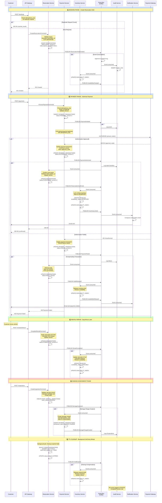

```mermaid
sequenceDiagram
    participant Customer
    participant Gateway as API Gateway
    participant ResSvc as Reservation Service
    participant PaySvc as Payment Service
    participant InvSvc as Inventory Service
    participant EventBus as Event Bus<br/>(Kafka)
    participant AuditSvc as Audit Service
    participant NotifSvc as Notification Service
    participant PaymentGW as Payment Gateway

    rect rgb(200, 220, 255)
        Note over Customer,PaymentGW: 1️⃣ BOOKING PHASE - Create Reservation Hold
    end

    Customer->>Gateway: POST /bookings
    Note over Gateway: Check idempotency_key<br/>for duplicate request
    
    alt Duplicate Request Found
        Gateway-->>Customer: 200 OK (cached_result)
    else First Request
        Gateway->>ResSvc: CreateReservationCommand
        
        Note over ResSvc: Validate inputs<br/>Generate reservation_id<br/>Lock optimistically
        
        ResSvc->>ResSvc: INSERT RESERVATIONS<br/>status=HOLD, version=1<br/>hold_expires_at=NOW+15min
        
        ResSvc->>EventBus: PUBLISH ReservationHoldCreated
        
        par Event Consumption
            EventBus->>EventBus: Append to EVENTS log
            
            EventBus->>AuditSvc: Event consumed
            AuditSvc->>AuditSvc: INSERT AUDIT_LOG
            
            EventBus->>InvSvc: Event consumed
            InvSvc->>InvSvc: UPDATE AVAILABILITY_INDEX
            InvSvc->>EventBus: PUBLISH AvailabilityChanged
        end
        
        ResSvc-->>Gateway: 201 Created
        Gateway-->>Customer: 201 Created
    end

    rect rgb(200, 220, 255)
        Note over Customer,PaymentGW: 2️⃣ PAYMENT PHASE - Authorize Payment
    end

    Customer->>Gateway: POST /payments
    Gateway->>PaySvc: ProcessPaymentCommand
    
    Note over PaySvc: Check idempotency_key<br/>Verify no duplicate<br/>Validate amount
    
    PaySvc->>PaySvc: INSERT PAYMENT_TRANSACTIONS<br/>status=PENDING, version=1
    
    PaySvc->>EventBus: PUBLISH PaymentInitiated
    
    par
        EventBus->>AuditSvc: Log event
    end

    Note over PaySvc: Call external payment gateway<br/>with idempotency_key
    
    PaySvc->>PaymentGW: AUTHORIZE (amount, token)

    alt Authorization Approved
        PaymentGW-->>PaySvc: 200 OK (approval_code)
        
        Note over PaySvc: Update payment transaction<br/>Increment version<br/>Store approval_code
        
        PaySvc->>PaySvc: UPDATE PAYMENT_TRANSACTIONS<br/>status=AUTHORIZED, version=2
        
        PaySvc->>EventBus: PUBLISH PaymentAuthorized
        
        par
            EventBus->>AuditSvc: Log state transition
            
            EventBus->>ResSvc: Event consumed
            Note over ResSvc: Confirm reservation<br/>Release hold_expires_at<br/>Update version
            
            ResSvc->>ResSvc: UPDATE RESERVATIONS<br/>status=CONFIRMED, version=2
            
            ResSvc->>EventBus: PUBLISH ReservationConfirmed
            
            EventBus->>InvSvc: Event consumed
            Note over InvSvc: Lock vehicle inventory<br/>Mark as RESERVED
            
            InvSvc->>InvSvc: UPDATE VEHICLES<br/>availability_status=RESERVED
            
            InvSvc->>InvSvc: UPDATE AVAILABILITY_INDEX
            
            InvSvc->>EventBus: PUBLISH InventoryLocked
            
            EventBus->>NotifSvc: Event consumed
            NotifSvc->>NotifSvc: Compose confirmation email
            NotifSvc->>Customer: Email sent
        end
        
        PaySvc-->>Gateway: 200 OK
        Gateway-->>Customer: 200 OK (confirmed)

    else Authorization Failed
        PaymentGW-->>PaySvc: 401 Unauthorized
        
        Note over PaySvc: Update payment transaction<br/>Record failure reason
        
        PaySvc->>PaySvc: UPDATE PAYMENT_TRANSACTIONS<br/>status=FAILED, version=2
        
        PaySvc->>EventBus: PUBLISH PaymentFailed
        
        par Compensating Transaction
            EventBus->>AuditSvc: Log failure
            
            EventBus->>ResSvc: Event consumed
            Note over ResSvc: Release hold<br/>Mark as FAILED<br/>Free up inventory
            
            ResSvc->>ResSvc: UPDATE RESERVATIONS<br/>status=HOLD_FAILED
            
            ResSvc->>EventBus: PUBLISH HoldReleased
            
            EventBus->>InvSvc: Event consumed
            Note over InvSvc: Release inventory lock<br/>Restore availability
            
            InvSvc->>InvSvc: UPDATE AVAILABILITY_INDEX
            
            InvSvc->>EventBus: PUBLISH AvailabilityReleased
            
            EventBus->>NotifSvc: Event consumed
            NotifSvc->>Customer: Email sent (payment_failed)
        end
        
        PaySvc-->>Gateway: 402 Payment Failed
        Gateway-->>Customer: 402 Payment Failed
    end

    rect rgb(200, 255, 200)
        Note over Customer,PaymentGW: 3️⃣ RENTAL PERIOD - Days/Hours Later
    end

    Note over Customer: Customer drives vehicle

    Customer->>Gateway: POST /rentals/id/return
    
    Gateway->>ResSvc: CompleteRentalCommand
    
    Note over ResSvc: Verify reservation ACTIVE<br/>Calculate final charges<br/>Update version
    
    ResSvc->>ResSvc: UPDATE RESERVATIONS<br/>status=COMPLETED, version=3
    
    ResSvc->>EventBus: PUBLISH RentalCompleted
    
    par
        EventBus->>InvSvc: Event consumed
        Note over InvSvc: Update odometer & fuel<br/>Calculate distance<br/>Restore availability
        
        InvSvc->>InvSvc: UPDATE VEHICLES<br/>availability_status=AVAILABLE
        
        InvSvc->>InvSvc: UPDATE AVAILABILITY_INDEX
    end

    rect rgb(255, 200, 200)
        Note over Customer,PaymentGW: 4️⃣ DAMAGE ASSESSMENT PHASE
    end

    Customer->>Gateway: POST /inspections
    
    Gateway->>ResSvc: CreateInspectionCommand
    
    Note over ResSvc: Validate damage photos<br/>Calculate damage cost<br/>Create claim
    
    ResSvc->>ResSvc: CREATE POST_RENTAL_INSPECTIONS<br/>claim_status=PENDING
    
    ResSvc->>EventBus: PUBLISH DamageAssessed

    par Damage Charge Creation
        EventBus->>PaySvc: Event consumed
        Note over PaySvc: Create damage charge<br/>Set idempotency_key<br/>Mark for authorization
        
        PaySvc->>PaySvc: INSERT PAYMENT_TRANSACTIONS<br/>transaction_type=DAMAGE_CHARGE
        
        PaySvc->>EventBus: PUBLISH DamageChargeCreated
        
        EventBus->>AuditSvc: Log all operations
    end

    rect rgb(255, 255, 200)
        Note over Customer,PaymentGW: 5️⃣ TTL CLEANUP - Background Job Every Minute
    end

    Note over ResSvc: Background job: Cleanup expired holds

    ResSvc->>ResSvc: SELECT FROM RESERVATIONS<br/>WHERE status=HOLD<br/>AND hold_expires_at < NOW
    
    ResSvc->>ResSvc: UPDATE status=HOLD_EXPIRED

    ResSvc->>EventBus: PUBLISH HoldExpired

    par Cleanup Compensation
        EventBus->>InvSvc: Events consumed
        Note over InvSvc: Release expired holds<br/>Restore inventory<br/>Update indices
        
        InvSvc->>InvSvc: UPDATE AVAILABILITY_INDEX
    end

    Note over AuditSvc: All events logged to EVENTS<br/>Complete forensic trail
```