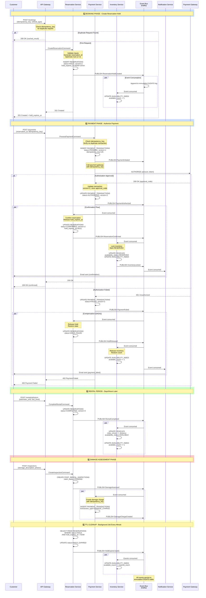

```mermaid
sequenceDiagram
    participant Customer
    participant Gateway as API Gateway
    participant ResSvc as Reservation Service
    participant PaySvc as Payment Service
    participant InvSvc as Inventory Service
    participant EventBus as Event Bus<br/>(Kafka)
    participant NotifSvc as Notification Service
    participant PaymentGW as Payment Gateway

    rect rgb(200, 220, 255)
        Note over Customer,PaymentGW: 1️⃣ BOOKING PHASE - Create Reservation Hold
    end

    Customer->>Gateway: POST /bookings<br/>(idempotency_key, vehicle_type)
    
    Note over Gateway: Check idempotency_key<br/>for duplicate request
    
    alt Duplicate Request Found
        Gateway-->>Customer: 200 OK (cached_result)
    else First Request
        Gateway->>ResSvc: CreateReservationCommand
        
        Note over ResSvc: Validate inputs<br/>Generate reservation_id<br/>Optimistic lock (v=1)
        
        ResSvc->>ResSvc: INSERT RESERVATIONS<br/>status=HOLD, version=1<br/>hold_expires_at=NOW+15min
        
        ResSvc->>EventBus: PUBLISH ReservationHoldCreated
        
        par Event Consumption
            EventBus->>EventBus: Append to immutable EVENTS log
            
            EventBus->>InvSvc: Event consumed
            InvSvc->>InvSvc: UPDATE AVAILABILITY_INDEX<br/>available_count -= 1
        end
        
        ResSvc-->>Gateway: 201 Created
        Gateway-->>Customer: 201 Created + hold_expires_at
    end

    rect rgb(200, 220, 255)
        Note over Customer,PaymentGW: 2️⃣ PAYMENT PHASE - Authorize Payment
    end

    Customer->>Gateway: POST /payments<br/>(reservation_id, idempotency_key)
    Gateway->>PaySvc: ProcessPaymentCommand
    
    Note over PaySvc: Check idempotency_key<br/>Verify no duplicate transaction
    
    PaySvc->>PaySvc: INSERT PAYMENT_TRANSACTIONS<br/>status=PENDING, version=1<br/>idempotency_key=UK
    
    PaySvc->>EventBus: PUBLISH PaymentInitiated
    
    Note over PaySvc: Call payment gateway<br/>with idempotency_key
    
    PaySvc->>PaymentGW: AUTHORIZE (amount, token)

    alt Authorization Approved
        PaymentGW-->>PaySvc: 200 OK (approval_code)
        
        Note over PaySvc: Update transaction<br/>version=2, store approval_code
        
        PaySvc->>PaySvc: UPDATE PAYMENT_TRANSACTIONS<br/>status=AUTHORIZED, version=2
        
        PaySvc->>EventBus: PUBLISH PaymentAuthorized
        
        par Confirmation Flow
            EventBus->>ResSvc: Event consumed
            Note over ResSvc: Confirm reservation<br/>Release hold_expires_at
            
            ResSvc->>ResSvc: UPDATE RESERVATIONS<br/>status=CONFIRMED, version=2<br/>hold_expires_at=NULL
            
            ResSvc->>EventBus: PUBLISH ReservationConfirmed
            
            EventBus->>InvSvc: Event consumed
            Note over InvSvc: Lock inventory<br/>Mark RESERVED
            
            InvSvc->>InvSvc: UPDATE VEHICLES<br/>availability_status=RESERVED<br/>UPDATE AVAILABILITY_INDEX
            
            InvSvc->>EventBus: PUBLISH InventoryLocked
            
            EventBus->>NotifSvc: Event consumed
            NotifSvc->>Customer: Email sent (confirmation)
        end
        
        PaySvc-->>Gateway: 200 OK
        Gateway-->>Customer: 200 OK (confirmed)

    else Authorization Failed
        PaymentGW-->>PaySvc: 401 Unauthorized
        
        PaySvc->>PaySvc: UPDATE PAYMENT_TRANSACTIONS<br/>status=FAILED, version=2
        
        PaySvc->>EventBus: PUBLISH PaymentFailed
        
        par Compensation (SAGA)
            EventBus->>ResSvc: Event consumed
            Note over ResSvc: Release hold<br/>Restore state
            
            ResSvc->>ResSvc: UPDATE RESERVATIONS<br/>status=HOLD_FAILED
            
            ResSvc->>EventBus: PUBLISH HoldReleased
            
            EventBus->>InvSvc: Event consumed
            Note over InvSvc: Release inventory<br/>Restore count
            
            InvSvc->>InvSvc: UPDATE AVAILABILITY_INDEX<br/>available_count += 1
            
            EventBus->>NotifSvc: Event consumed
            NotifSvc->>Customer: Email sent (payment_failed)
        end
        
        PaySvc-->>Gateway: 402 Payment Failed
        Gateway-->>Customer: 402 Payment Failed
    end

    rect rgb(200, 255, 200)
        Note over Customer,PaymentGW: 3️⃣ RENTAL PERIOD - Days/Hours Later
    end

    Customer->>Gateway: POST /rentals/id/return<br/>(odometer_end, fuel_level)
    
    Gateway->>ResSvc: CompleteRentalCommand
    
    ResSvc->>ResSvc: UPDATE RESERVATIONS<br/>status=COMPLETED, version=3
    
    ResSvc->>EventBus: PUBLISH RentalCompleted
    
    par
        EventBus->>InvSvc: Event consumed
        
        InvSvc->>InvSvc: UPDATE VEHICLES<br/>miles_driven += distance<br/>availability_status=AVAILABLE
        
        InvSvc->>InvSvc: UPDATE AVAILABILITY_INDEX<br/>available_count += 1
    end

    rect rgb(255, 200, 200)
        Note over Customer,PaymentGW: 4️⃣ DAMAGE ASSESSMENT PHASE
    end

    Customer->>Gateway: POST /inspections<br/>(damage_description, photos)
    
    Gateway->>ResSvc: CreateInspectionCommand
    
    ResSvc->>ResSvc: CREATE POST_RENTAL_INSPECTIONS<br/>claim_status=PENDING
    
    ResSvc->>EventBus: PUBLISH DamageAssessed

    par
        EventBus->>PaySvc: Event consumed
        Note over PaySvc: Create damage charge<br/>with idempotency_key
        
        PaySvc->>PaySvc: INSERT PAYMENT_TRANSACTIONS<br/>transaction_type=DAMAGE_CHARGE
        
        PaySvc->>EventBus: PUBLISH DamageChargeCreated
    end

    rect rgb(255, 255, 200)
        Note over Customer,PaymentGW: 5️⃣ TTL CLEANUP - Background Job Every Minute
    end

    ResSvc->>ResSvc: SELECT FROM RESERVATIONS<br/>WHERE status=HOLD<br/>AND hold_expires_at < NOW
    
    ResSvc->>ResSvc: UPDATE status=HOLD_EXPIRED

    ResSvc->>EventBus: PUBLISH HoldExpired (bulk)

    par
        EventBus->>InvSvc: Events consumed
        
        InvSvc->>InvSvc: UPDATE AVAILABILITY_INDEX<br/>available_count += expired_count
    end

    Note over EventBus: All events persist to<br/>immutable EVENTS table

```