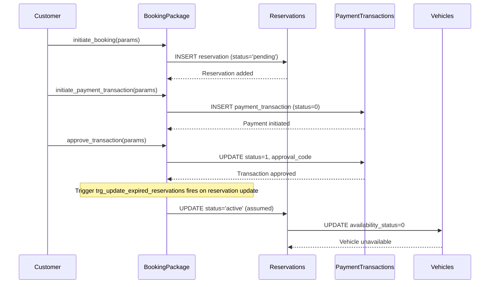

```mermaid
sequenceDiagram
    participant Customer
    participant BookingPackage
    participant Reservations
    participant PaymentTransactions
    participant Vehicles

    Customer->>BookingPackage: initiate_booking(params)
    BookingPackage->>Reservations: INSERT reservation (status='pending')
    Reservations-->>BookingPackage: Reservation added

    Customer->>BookingPackage: initiate_payment_transaction(params)
    BookingPackage->>PaymentTransactions: INSERT payment_transaction (status=0)
    PaymentTransactions-->>BookingPackage: Payment initiated

    Customer->>BookingPackage: approve_transaction(params)
    BookingPackage->>PaymentTransactions: UPDATE status=1, approval_code
    PaymentTransactions-->>BookingPackage: Transaction approved

    Note over BookingPackage: Trigger trg_update_expired_reservations fires on reservation update
    BookingPackage->>Reservations: UPDATE status='active' (assumed)
    Reservations->>Vehicles: UPDATE availability_status=0
    Vehicles-->>Reservations: Vehicle unavailable
```