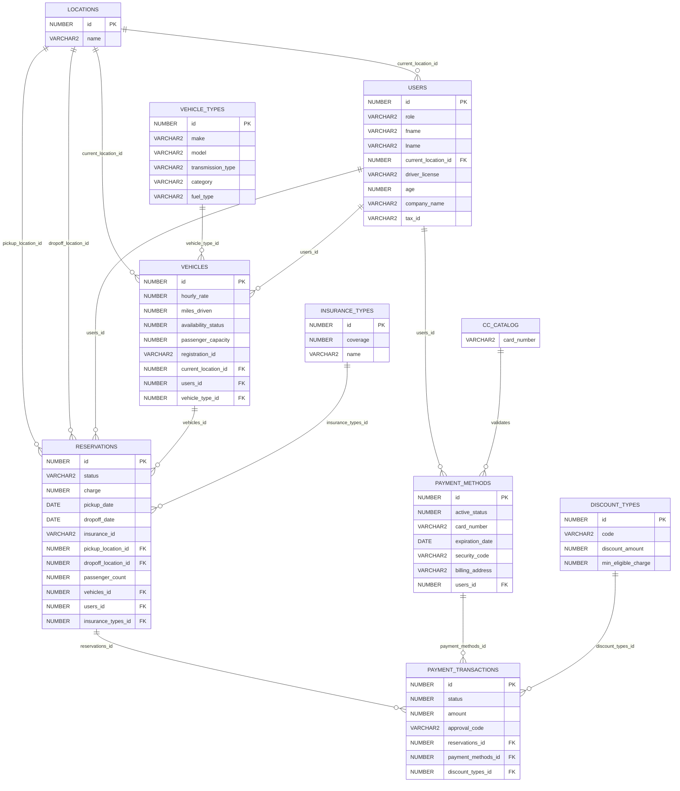

```mermaid
erDiagram
    LOCATIONS ||--o{ USERS : "current_location_id"
    LOCATIONS ||--o{ VEHICLES : "current_location_id"
    LOCATIONS ||--o{ RESERVATIONS : "pickup_location_id"
    LOCATIONS ||--o{ RESERVATIONS : "dropoff_location_id"
    VEHICLE_TYPES ||--o{ VEHICLES : "vehicle_type_id"
    USERS ||--o{ PAYMENT_METHODS : "users_id"
    USERS ||--o{ VEHICLES : "users_id"
    USERS ||--o{ RESERVATIONS : "users_id"
    VEHICLES ||--o{ RESERVATIONS : "vehicles_id"
    INSURANCE_TYPES ||--o{ RESERVATIONS : "insurance_types_id"
    RESERVATIONS ||--o{ PAYMENT_TRANSACTIONS : "reservations_id"
    PAYMENT_METHODS ||--o{ PAYMENT_TRANSACTIONS : "payment_methods_id"
    DISCOUNT_TYPES ||--o{ PAYMENT_TRANSACTIONS : "discount_types_id"
    CC_CATALOG ||--o{ PAYMENT_METHODS : "validates"

    LOCATIONS {
        NUMBER id PK
        VARCHAR2 name
    }

    VEHICLE_TYPES {
        NUMBER id PK
        VARCHAR2 make
        VARCHAR2 model
        VARCHAR2 transmission_type
        VARCHAR2 category
        VARCHAR2 fuel_type
    }

    DISCOUNT_TYPES {
        NUMBER id PK
        VARCHAR2 code
        NUMBER discount_amount
        NUMBER min_eligible_charge
    }

    INSURANCE_TYPES {
        NUMBER id PK
        NUMBER coverage
        VARCHAR2 name
    }

    USERS {
        NUMBER id PK
        VARCHAR2 role
        VARCHAR2 fname
        VARCHAR2 lname
        NUMBER current_location_id FK
        VARCHAR2 driver_license
        NUMBER age
        VARCHAR2 company_name
        VARCHAR2 tax_id
    }

    PAYMENT_METHODS {
        NUMBER id PK
        NUMBER active_status
        VARCHAR2 card_number
        DATE expiration_date
        VARCHAR2 security_code
        VARCHAR2 billing_address
        NUMBER users_id FK
    }

    VEHICLES {
        NUMBER id PK
        NUMBER hourly_rate
        NUMBER miles_driven
        NUMBER availability_status
        NUMBER passenger_capacity
        VARCHAR2 registration_id
        NUMBER current_location_id FK
        NUMBER users_id FK
        NUMBER vehicle_type_id FK
    }

    RESERVATIONS {
        NUMBER id PK
        VARCHAR2 status
        NUMBER charge
        DATE pickup_date
        DATE dropoff_date
        VARCHAR2 insurance_id
        NUMBER pickup_location_id FK
        NUMBER dropoff_location_id FK
        NUMBER passenger_count
        NUMBER vehicles_id FK
        NUMBER users_id FK
        NUMBER insurance_types_id FK
    }

    PAYMENT_TRANSACTIONS {
        NUMBER id PK
        NUMBER status
        NUMBER amount
        VARCHAR2 approval_code
        NUMBER reservations_id FK
        NUMBER payment_methods_id FK
        NUMBER discount_types_id FK
    }

    CC_CATALOG {
        VARCHAR2 card_number
    }
```