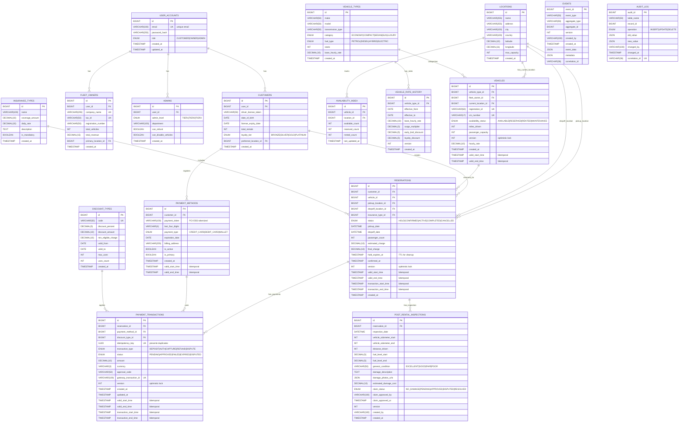

```mermaid
erDiagram
    %% USER DOMAIN
    USER_ACCOUNTS ||--o{ CUSTOMERS : "has"
    USER_ACCOUNTS ||--o{ FLEET_OWNERS : "has"
    USER_ACCOUNTS ||--o{ ADMINS : "has"
    
    USER_ACCOUNTS {
        BIGINT id PK
        VARCHAR(100) email UK "unique email"
        VARCHAR(255) password_hash
        ENUM role "CUSTOMER|OWNER|ADMIN"
        TIMESTAMP created_at
        TIMESTAMP updated_at
    }

    CUSTOMERS {
        BIGINT id PK
        BIGINT user_id FK
        VARCHAR(50) driver_license_token
        DATE date_of_birth
        DATE license_expiry_date
        INT total_rentals
        ENUM loyalty_tier "BRONZE|SILVER|GOLD|PLATINUM"
        BIGINT preferred_location_id FK
        TIMESTAMP created_at
    }

    FLEET_OWNERS {
        BIGINT id PK
        BIGINT user_id FK
        VARCHAR(255) company_name UK
        VARCHAR(50) tax_id UK
        VARCHAR(50) registration_number
        INT total_vehicles
        DECIMAL(15) total_revenue
        BIGINT primary_location_id FK
        TIMESTAMP created_at
    }

    ADMINS {
        BIGINT id PK
        BIGINT user_id FK
        ENUM admin_level "TIER1|TIER2|TIER3"
        VARCHAR(100) department
        BOOLEAN can_refund
        BOOLEAN can_disable_vehicles
        TIMESTAMP created_at
    }

    %% LOCATION DOMAIN
    LOCATIONS ||--o{ VEHICLES : "has_current_location"
    LOCATIONS ||--o{ RESERVATIONS : "pickup_location"
    LOCATIONS ||--o{ RESERVATIONS : "dropoff_location"
    LOCATIONS ||--o{ AVAILABILITY_INDEX : "tracks"
    
    LOCATIONS {
        BIGINT id PK
        VARCHAR(255) name
        VARCHAR(255) address
        VARCHAR(100) city
        VARCHAR(100) country
        DECIMAL(10) latitude
        DECIMAL(11) longitude
        INT max_capacity
        TIMESTAMP created_at
    }

    %% VEHICLE DOMAIN
    VEHICLE_TYPES ||--o{ VEHICLES : "categorizes"
    VEHICLE_TYPES ||--o{ VEHICLE_RATE_HISTORY : "has_rates"
    
    VEHICLE_TYPES {
        BIGINT id PK
        VARCHAR(50) make
        VARCHAR(50) model
        VARCHAR(50) transmission_type
        ENUM category "ECONOMY|COMPACT|SEDAN|SUV|LUXURY"
        ENUM fuel_type "PETROL|DIESEL|HYBRID|ELECTRIC"
        INT seats
        DECIMAL(10) base_hourly_rate
        TIMESTAMP created_at
    }

    VEHICLES {
        BIGINT id PK
        BIGINT vehicle_type_id FK
        BIGINT fleet_owner_id FK
        BIGINT current_location_id FK
        VARCHAR(50) registration_id UK
        VARCHAR(17) vin_number UK
        ENUM availability_status "AVAILABLE|RESERVED|RENTED|MAINTENANCE"
        INT miles_driven
        INT passenger_capacity
        INT version "optimistic lock"
        DECIMAL(10) hourly_rate
        TIMESTAMP created_at
        TIMESTAMP valid_start_time "bitemporal"
        TIMESTAMP valid_end_time "bitemporal"
    }

    VEHICLE_RATE_HISTORY {
        BIGINT id PK
        BIGINT vehicle_type_id FK
        DATE effective_from
        DATE effective_to
        DECIMAL(10) base_hourly_rate
        DECIMAL(3) surge_multiplier
        DECIMAL(5) early_bird_discount
        DECIMAL(5) loyalty_discount
        INT version
        TIMESTAMP created_at
    }

    %% RESERVATION DOMAIN
    CUSTOMERS ||--o{ RESERVATIONS : "creates"
    VEHICLES ||--o{ RESERVATIONS : "reserved_for"
    INSURANCE_TYPES ||--o{ RESERVATIONS : "includes"
    
    RESERVATIONS {
        BIGINT id PK
        BIGINT customer_id FK
        BIGINT vehicle_id FK
        BIGINT pickup_location_id FK
        BIGINT dropoff_location_id FK
        BIGINT insurance_type_id FK
        ENUM status "HOLD|CONFIRMED|ACTIVE|COMPLETED|CANCELLED"
        DATETIME pickup_date
        DATETIME dropoff_date
        INT passenger_count
        DECIMAL(10) estimated_charge
        DECIMAL(10) final_charge
        TIMESTAMP hold_expires_at "TTL for cleanup"
        TIMESTAMP confirmed_at
        INT version "optimistic lock"
        TIMESTAMP valid_start_time "bitemporal"
        TIMESTAMP valid_end_time "bitemporal"
        TIMESTAMP transaction_start_time "bitemporal"
        TIMESTAMP transaction_end_time "bitemporal"
        TIMESTAMP created_at
    }

    INSURANCE_TYPES {
        BIGINT id PK
        VARCHAR(100) name
        DECIMAL(10) coverage_amount
        DECIMAL(10) daily_rate
        TEXT description
        BOOLEAN is_mandatory
        TIMESTAMP created_at
    }

    %% PAYMENT DOMAIN
    RESERVATIONS ||--o{ PAYMENT_TRANSACTIONS : "has_payments"
    CUSTOMERS ||--o{ PAYMENT_METHODS : "registers"
    PAYMENT_METHODS ||--o{ PAYMENT_TRANSACTIONS : "uses"
    DISCOUNT_TYPES ||--o{ PAYMENT_TRANSACTIONS : "applies"
    
    PAYMENT_METHODS {
        BIGINT id PK
        BIGINT customer_id FK
        VARCHAR(100) payment_token "PCI-DSS tokenized"
        VARCHAR(4) last_four_digits
        ENUM payment_type "CREDIT_CARD|DEBIT_CARD|WALLET"
        DATE expiration_date
        VARCHAR(255) billing_address
        BOOLEAN is_active
        BOOLEAN is_primary
        TIMESTAMP created_at
        TIMESTAMP valid_start_time "bitemporal"
        TIMESTAMP valid_end_time "bitemporal"
    }

    PAYMENT_TRANSACTIONS {
        BIGINT id PK
        BIGINT reservation_id FK
        BIGINT payment_method_id FK
        BIGINT discount_type_id FK
        UUID idempotency_key UK "prevents duplicates"
        ENUM transaction_type "DEPOSIT|AUTH|CAPTURE|REFUND|DISPUTE"
        ENUM status "PENDING|APPROVED|FAILED|EXPIRED|DISPUTED"
        DECIMAL(10) amount
        VARCHAR(3) currency
        VARCHAR(50) approval_code
        VARCHAR(100) gateway_transaction_id UK
        INT version "optimistic lock"
        TIMESTAMP created_at
        TIMESTAMP updated_at
        TIMESTAMP valid_start_time "bitemporal"
        TIMESTAMP valid_end_time "bitemporal"
        TIMESTAMP transaction_start_time "bitemporal"
        TIMESTAMP transaction_end_time "bitemporal"
    }

    DISCOUNT_TYPES {
        BIGINT id PK
        VARCHAR(50) code UK
        DECIMAL(5) discount_percent
        DECIMAL(10) discount_amount
        DECIMAL(10) min_eligible_charge
        DATE valid_from
        DATE valid_to
        INT max_uses
        INT uses_count
        TIMESTAMP created_at
    }

    %% POST-RENTAL DOMAIN
    RESERVATIONS ||--o{ POST_RENTAL_INSPECTIONS : "has_inspection"
    
    POST_RENTAL_INSPECTIONS {
        BIGINT id PK
        BIGINT reservation_id FK
        DATETIME inspection_date
        INT vehicle_odometer_start
        INT vehicle_odometer_end
        INT distance_driven
        DECIMAL(5) fuel_level_start
        DECIMAL(5) fuel_level_end
        VARCHAR(50) general_condition "EXCELLENT|GOOD|FAIR|POOR"
        TEXT damage_description
        JSON damage_photos_urls
        DECIMAL(10) estimated_damage_cost
        ENUM claim_status "NO_DAMAGE|PENDING|APPROVED|DISPUTED|RESOLVED"
        VARCHAR(100) claim_approved_by
        TIMESTAMP claim_approved_at
        INT version
        VARCHAR(100) created_by
        TIMESTAMP created_at
    }

    %% AUDIT &amp; COMPLIANCE
    EVENTS {
        BIGINT event_id PK
        VARCHAR(50) event_type
        VARCHAR(50) aggregate_type
        BIGINT aggregate_id
        INT version
        VARCHAR(100) created_by
        TIMESTAMP created_at
        JSON event_data
        JSON metadata
        VARCHAR(36) correlation_id
    }

    AUDIT_LOG {
        BIGINT audit_id PK
        VARCHAR(50) table_name
        BIGINT record_id
        ENUM operation "INSERT|UPDATE|DELETE"
        JSON old_value
        JSON new_value
        VARCHAR(100) changed_by
        TIMESTAMP changed_at
        VARCHAR(36) correlation_id UK
    }

    %% ANALYTICS &amp; READ MODELS
    AVAILABILITY_INDEX {
        BIGINT id PK
        BIGINT vehicle_id FK
        BIGINT location_id FK
        INT available_count
        INT reserved_count
        INT rented_count
        TIMESTAMP last_updated_at
    }
```